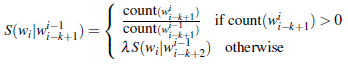
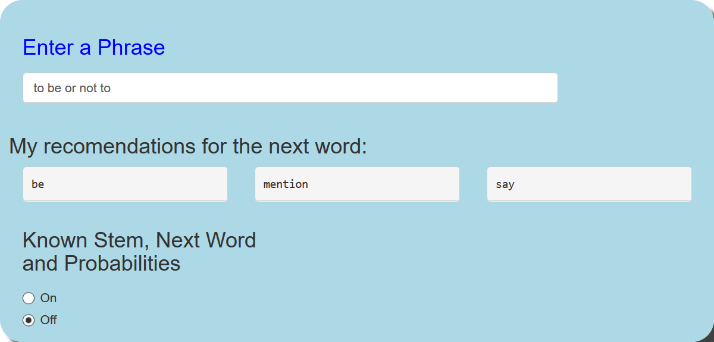

Next Word Prediction
========================================================
author: Michael Coote
date: April 7, 2019
autosize: true
Using Natural Language Processing  
Data Science Staff Presentation

Introduction
========================================================

<u>N-Gram Corpus Linguistic Processing</u>

*  Given a set of preceeding words, the next word can be predicted

*  Markov Assumption - the probability of a word depends only on the probability of a limited history (n previous words)

*  N-Gram Models use the previous N-1 Words in a sequence to predict the next word.

*  The language model is trained on a very large corpus (online text collection), consisting of news, tweets and blogs.

*  Term (n-gram) frequency is the basis for the probability estimations

Algorithm
========================================================

The [Stupid Backoff](http://www.aclweb.org/anthology/D07-1090.pdf) algorithm was chosen after consideration for Katz Backoff and Kneser-Ney due to its simplicity and performance (fast processing and efficient memory utilization).

*  For each n-gram it's probabilies are found in pre-processing through count of ngram / sum(n-1 ngram count)

*  Probabilities are not normalized and should be considered as rank. Each lower order n-gram (n-k-gram) with a matching stem (n-gram without the next word prediction) was assigned a discounted probability (pre-processed probability * 0.4^k).

Algorithm Novelties
========================================================

The uniqueness of the approach taken in my application is that I was able to process the entire corpus up to 6-grams. 

*  Processing was done on just 8Gb RAM using a chunking method; both in the tokenization and pruning

*  Significant pruning was needed to keep the application within the 1Gb Shiny.io "free" runtime limit: ngram count > 2, top 90%, long/short words and ngrams, etc.

*  Use of the data.table package with pre-set keys on the ngram stem words for fast lookup.

*  Only the top 3 ranked stems of each ngram set was needed after pre-calcs.

Shiny Application
========================================================

The application is plublished at 
[ShinyApp](https://cootem.shinyapps.io/NextWord/)
You simply enter a phrase and three next word recomendations will appear as you type. It also includes an option to view the ngram lookups, pre-calc probabilities and discounted probabilitites.

